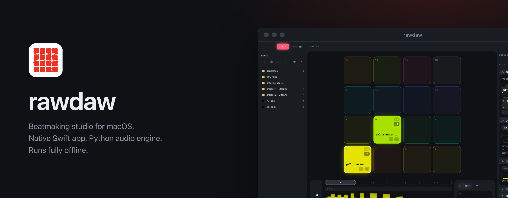
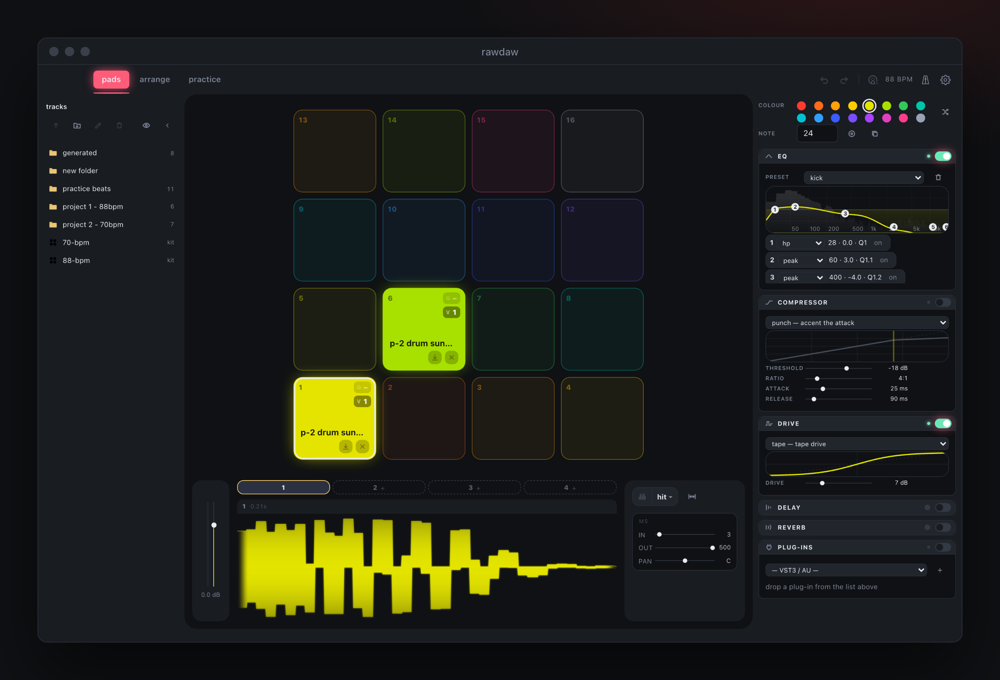
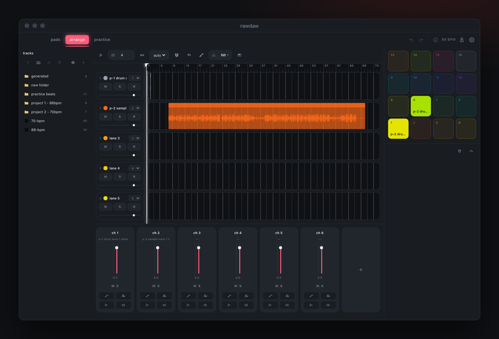
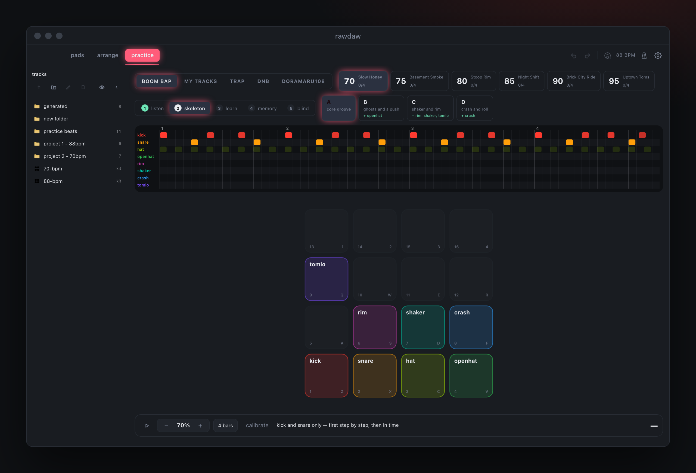

### pads

16 pads, 4 layers each. Slice by hit or by grid, ¼ to 8. Per-pad EQ, compressor, drive, delay, reverb, VST3 and AU.

### arrange

Clip lanes on one timeline. Channel mixer, piano roll, plugins.

### practice

Finger drumming trainer. Boom bap 70 to 95 BPM, trap, dnb. Five steps: listen, skeleton, learn, memory, blind. Hits graded at ±20 and ±45 ms.

### Hardware

Maschine Mikro MK3 over USB HID, no MIDI mode needed. Any other controller over CoreMIDI.

### Export

Each layer as WAV with hit markers and tempo inside. Ableton, Logic and Reaper open it already marked.

### Stack

| | |
|---|---|
| app | Swift, WKWebView, CoreMIDI, IOKit HID |
| engine | Python, numpy, soundfile |
| UI | HTML, JavaScript |

Source code is private.
